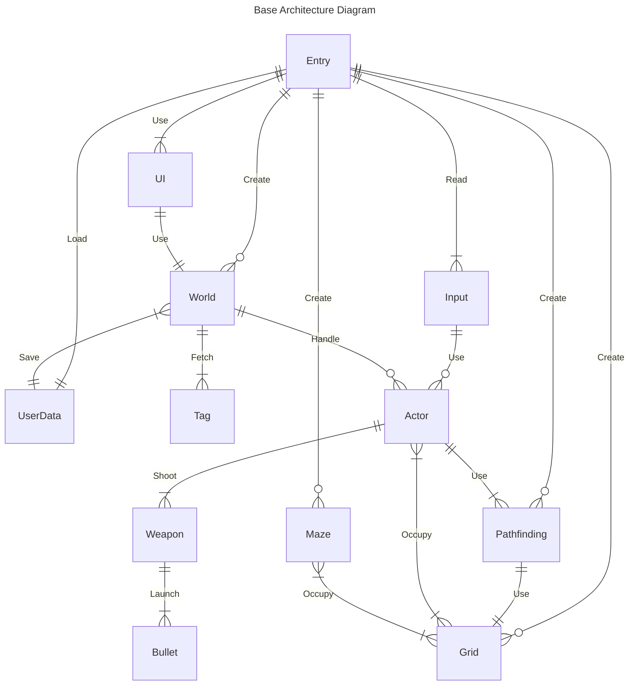
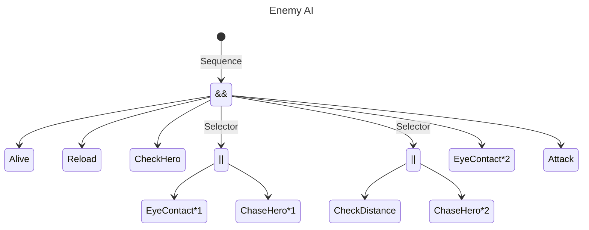

## Space Marine
### Unity game architecture sample

The most convenient OOP game architecture sample that I can made with the lowest lines of code with no threading tricks.

#### In use
 - OOP architecture with actor-based entities.
 - Pure DI, the game uses constructor injection and bind methods to inject dependencies into objects. This ensures that there are no static references.
 - AStar grid pathfinding algorithm with a priority queue and runtime generation. Additionally, the game updates tile occupation with dynamic cost.
 - Behaviour Tree AI system. 
 - Weapons with perks, bullet pools, and simple verlet ballistics.
 - Simple save system.
 - Full-screen sharpen shader, as URP render feature.
 - Widgets that poll data from actors.

 #### Behaviour tree

### Gameplay
- The game features a procedurally generated maze where players must survive by battling enemies.
- Enemies spawn from outposts placed on the map, and victory is achieved by destroying all of them.
- Points are awarded for killing enemies and taking down outposts, with health packs dropped by enemies to aid in healing.
- Player progress is saved as best score.

### Possible optimization points
- Handle bullets and actors transforms via TransformArrayAccess.
- Custom physics system.
- Health bars and trackers via GPU.

_Unity 2022.3.3_
 

https://github.com/aleksandrpp/SpaceMarine